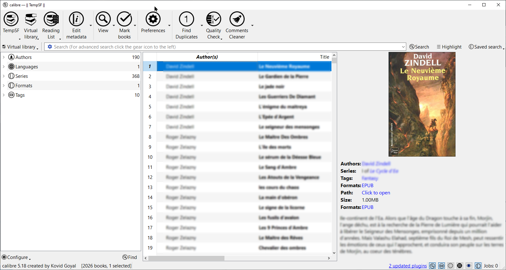
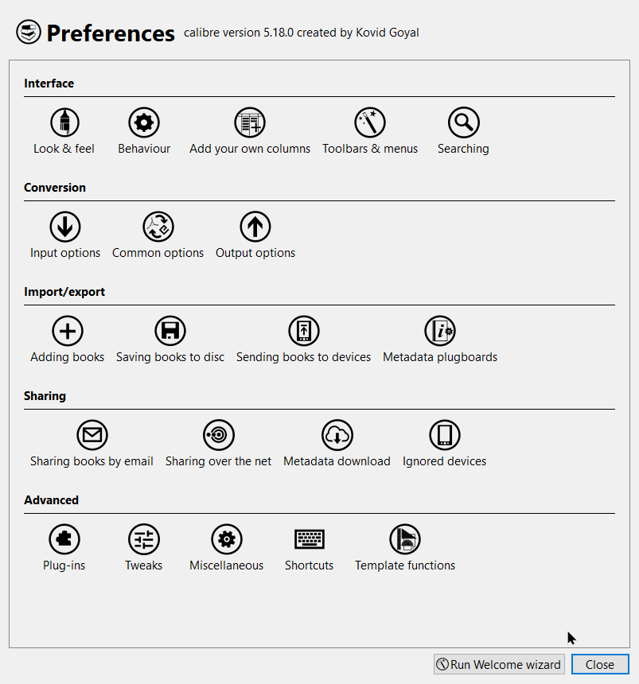
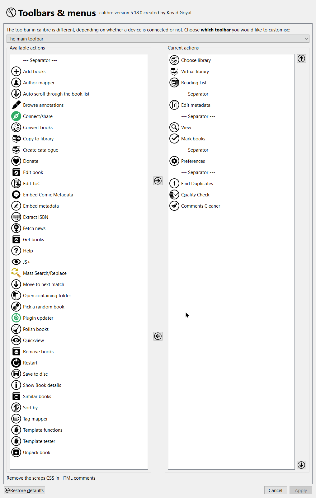

# Metro Enhanced Icon Set for Calibre

Icon set Metro Enhanced for Calibre based from Metro icon set.

## How to use

1. Set icon to Metro in Calibre
2. Back Up you existing AppData/Roaming/calibre/resources/images folder.
3. Extract the files to your AppData/Roaming/calibre/resources/images folder.
4. Restart Calibre
5. Enjoy.

## Screenshot

